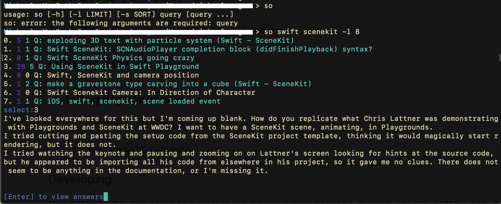

# Stack Overflow CLI

Browse Stack Overflow from your terminal. Look cool.

## Getting Started

### Installing dependencies

1. `$ pip3 install BeautifulSoup`

2. `$ pip3 install requests`

### Developing

Using Python 3.x, this command creates the stackoverflow package,
making `stackoverflow` and `so` executable.

`$ python setup.py develop`

## Usage

`$ stackoverflow <your search>`

OR shorthand:

`$ so <your search>`

## Flags

`-h, --help` help

`-l, --limit` limit number of search results

`-s, --sort` sort by relevance, newest, votes, or active
