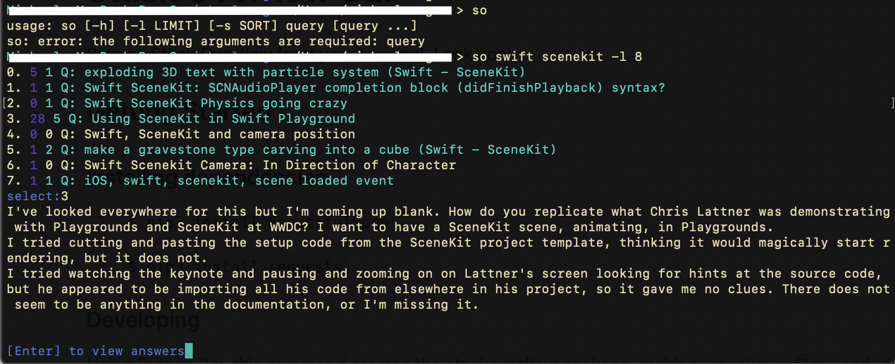

# Stack Overflow CLI

Python 3.7 

Browse Stack Overflow from your terminal. Look cool.

## Getting Started

The `stackoverflow` (or `so`) command prints search results for questions on stack overflow. Just type in your search terms, and see the flags for more options. Type the question number you want to inspect, and press Enter to keep browsing.

### Installing dependencies

`$ pip install beautifulsoup4 requests tox`

Or to install all dependencies, use:

`$ pip install -r requirements.txt`

### Building

Using Python 3.x, this command creates the stackoverflow package,
making `stackoverflow` and `so` executable.

`$ python setup.py develop`

### Testing

The tox command executes the test suite.

`$ tox`

## Usage

`$ stackoverflow <your search>`

OR shorthand:

`$ so <your search>`

## Flags

`-h, --help` help

`-l, --limit` limit number of search results

`-s, --sort` sort by relevance, newest, votes, or active
